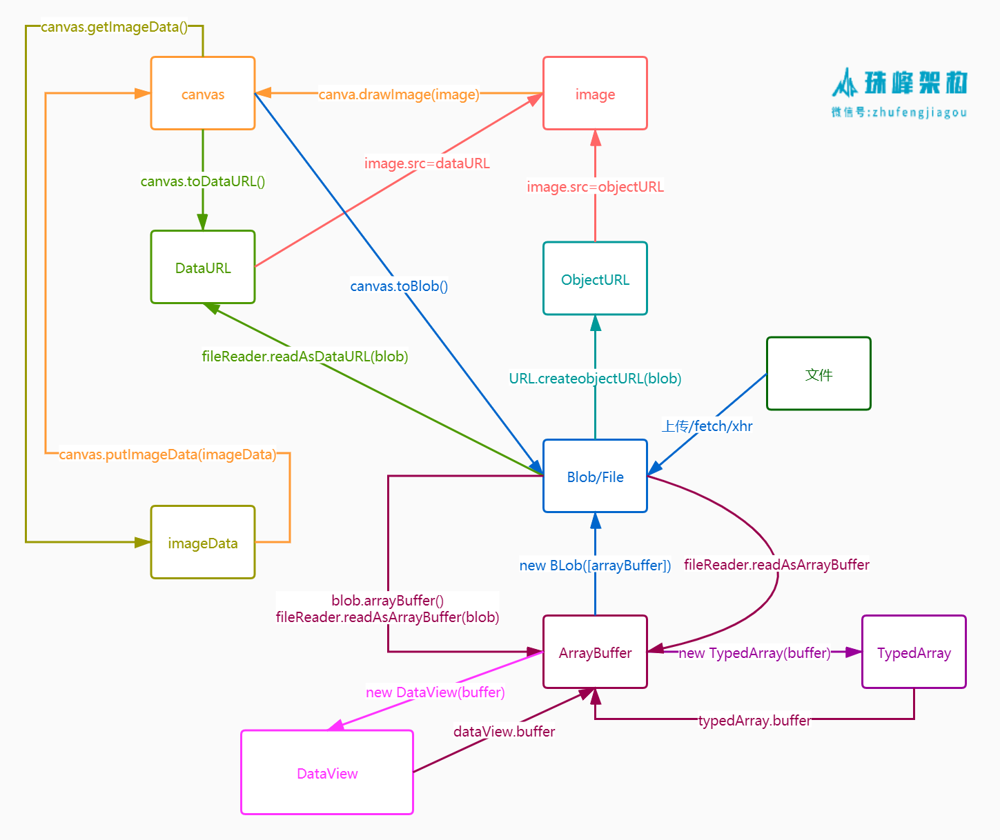

# 前端二进制的总结



## TypeArray

描述了一个底层的二进制数据缓冲区
int8Array (-128~127)
unint8Array (0~255)
Int16Array (-32768 32767)
Unint16Array (65535)

 ```javascript
let buffer = new ArrayBuffer(8)
console.log(buffer.byteLength)
const int8Array = new Int8Array(buffer)
console.log(int8Array.length)
console.log(int8Array.buffer === buffer)
let int16Array = new Int16Array(buffer)
console.log()
 ```

## DataView

可以读取多种数据类型的

 ```javascript
let buffer = new ArrayBuffer(2)
console.log(buffer.byteLength)
let dataView = new DataView(buffer)
dataView.setInt8(0,1)
dataView.setInt8(1,2)
console.log(dataView.getInt8(0)) //1
console.log(dataView.getInt8(1)) //2
console.log(dataView.buffer === buffer)
// DataView 和 TypeArray 都内部引用了buffer
 ```

## blob

不可变的类文件对象

```javascript
let debug = {name:'helloworld'}
let str = JSON.stringify(debug)
console.log(str)
let blob = new Blob([str],{type:'application/json'});
console.log(blob.size)

function readBlob(blob,type){
    return new Promise(function(resolve){
        let reader = new FileReader();
        reader.onload = function(event){
            resolve(event.target.result);
        }
        switch(type){
            case 'ArrayBuffer':
                reader.readAsArrayBuffer(blob)
                break;
            case 'dataUrl': //二进制数据转成刻度都字符串 base64
                reader.readAsDataURL(blob)
                break;
            case 'ArrayBuffer':
                reader.readAsText(blob)
                break;
            default:
                break;
        }
    })
}
```

## Object URL

```js
let debug = {name:'helloworld'}
let str = JSON.stringify(debug)
let blob = new Blob([str],{type:'application/json'});
let a = document.createElement('a');
a.download = 'user.json'
a.rel = 'noopener'
a.href= URL.createObjectURL(blob)
a.dispatchEvent(new MouseEnet('click'))
URL.revokeObjectURL(blob); // 销毁url
```


